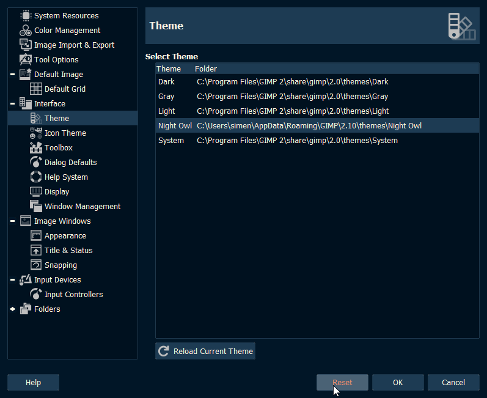
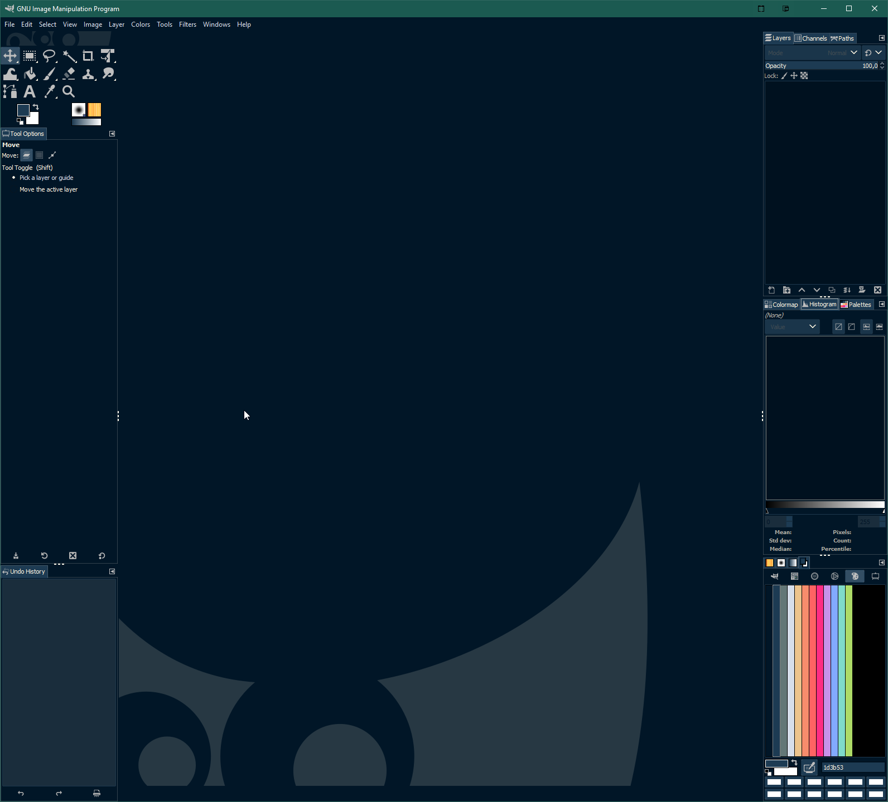

# GIMP-NightOwl
 Night Owl dark theme for GIMP 2.10

This theme is modified from the default GIMP 2.0 dark theme.

Color scheme inspired by the Night Owl theme for Visual Studio Code by [Sarah Drasner](https://github.com/sdras/night-owl-vscode-theme)

Some additional shades were added to differentiate UI elements.

Feel free to modify the files to your preference.

Screenshots:

Preferences theme dialog.

Application view.

